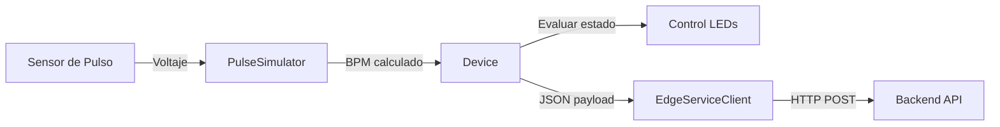

# 🐾 PetLink - Sistema IoT de Monitoreo Cardíaco Veterinario
## Enlace al proyecto Wokwi
[](https://wokwi.com/projects/446707706509743105)

## 📋 Descripción
Sistema de monitoreo en tiempo real del ritmo cardíaco de mascotas durante fase de internamiento veterinario, utilizando collares IoT con ESP32 y simulación en Wokwi.

## ✨ Características

### 🔧 Configuración mediante Variables de Entorno
- **Device ID configurable**: Identificador único del collar (`DEVICE_ID`)
- **Umbrales de BPM personalizables**: 
  - `BPM_CRITICAL_LOW`: Bradicardia severa (default: < 50 BPM)
  - `BPM_NORMAL_LOW/HIGH`: Rango normal (default: 60-120 BPM)
  - `BPM_ALERT_HIGH`: Taquicardia moderada (default: 121-140 BPM)
  - `BPM_CRITICAL_HIGH`: Taquicardia severa (default: > 160 BPM)
- **URL del backend**: Endpoint para envío de datos (`EDGE_BACKEND_URL`)

### 🚦 Sistema de Alertas con LEDs
- 🟢 **LED Verde**: Ritmo cardíaco normal (60-120 BPM)
- 🟡 **LED Amarillo**: Alerta - Taquicardia moderada (121-140 BPM)
- 🔴 **LED Rojo**: Crítico - Bradicardia o taquicardia severa (< 50 o > 160 BPM)

### 📡 Conectividad
- WiFi integrado (ESP32)
- Envío de datos al backend cada 2 segundos
- Formato JSON estandarizado
- Sincronización NTP para timestamps precisos

### 📊 Formato de Datos

```json
{
  "device_id": "COLLAR-001",
  "timestamp": "2024-12-02T10:30:45Z",
  "bpm": 85
}
```

## 🏗️ Arquitectura del Sistema

```
┌─────────────────┐
│   ESP32 + WiFi  │
│  (Collar IoT)   │
└────────┬────────┘
         │
         │ Sensor de Pulso
         │ (Simulado)
         │
         ▼
┌─────────────────┐
│  Edge Service   │◄──── WiFi ────► Backend
│    Client       │                SpringBoot
└─────────────────┘
         │
         │ HTTP POST
         │
         ▼
┌─────────────────┐
│   Backend API   │
│   (Spring)      │
└─────────────────┘
```

## 📦 Componentes del Hardware (Wokwi)

1. **ESP32 DevKit C v4**: Controlador principal
2. **Sensor de Pulso Personalizado**: Simulación de SEN-11574
3. **3 LEDs indicadores**:
   - LED Verde (Pin 12) - Estado normal
   - LED Amarillo (Pin 14) - Estado de alerta
   - LED Rojo (Pin 13) - Estado crítico
4. **Resistencias de 220Ω**: Protección de LEDs

## 🔌 Configuración de Pines

| Componente | Pin ESP32 | Descripción |
|------------|-----------|-------------|
| Sensor Pulso | GPIO 35 | Entrada analógica |
| LED Verde | GPIO 12 | Indicador normal |
| LED Amarillo | GPIO 14 | Indicador alerta |
| LED Rojo | GPIO 13 | Indicador crítico |
| SDA (I2C) | GPIO 23 | Comunicación I2C |
| SCL (I2C) | GPIO 22 | Comunicación I2C |

## 🚀 Configuración e Instalación

### 1. Variables de Entorno (config.h)

```cpp
// Identificación del dispositivo
#define DEVICE_ID "COLLAR-001"  // 🔧 Cambiar según el collar

// Umbrales de BPM (ajustar según raza/tamaño)
#define BPM_CRITICAL_LOW 50
#define BPM_NORMAL_LOW 60
#define BPM_NORMAL_HIGH 120
#define BPM_ALERT_HIGH 140
#define BPM_CRITICAL_HIGH 160

// Backend URL
#define EDGE_BACKEND_URL "https://tu-backend.com/api/heartrate"
```

### 2. Compilar y Cargar

```bash
# En Wokwi, simplemente presiona el botón "Start Simulation"
```

### 3. Conectar WiFi

El sistema se conecta automáticamente a:
- SSID: `Wokwi-GUEST`
- Password: (vacío)

## 📱 Uso

1. **Inicio del Sistema**: 
   - Al encender, se realiza un test de LEDs
   - Se muestra la configuración de umbrales
   - Se conecta a WiFi

2. **Monitoreo Continuo**:
   - Lee el ritmo cardíaco cada 500ms
   - Actualiza LEDs según el estado
   - Envía datos al backend cada 2 segundos

3. **Interpretación de Estados**:

```
🔴 < 50 BPM     → Bradicardia severa (CRÍTICO)
🟢 60-120 BPM   → Rango normal (SALUDABLE)
🟡 121-140 BPM  → Taquicardia moderada (ALERTA)
🔴 > 160 BPM    → Taquicardia severa (CRÍTICO)
```

## 🎯 Estándares Veterinarios de BPM

### Perros
- **Razas pequeñas**: 70-180 BPM
- **Razas medianas**: 60-140 BPM
- **Razas grandes**: 60-100 BPM

### Gatos
- **Rango normal**: 140-220 BPM

> 💡 **Nota**: Los umbrales pueden ajustarse en `config.h` según la especie y tamaño del animal.

## 📂 Estructura del Proyecto

```
petlink-wokwi-app/
├── config.h                    # 🔧 Variables de entorno
├── Device.h / Device.cpp       # Clase principal del dispositivo
├── EdgeServiceClient.h / .cpp  # Cliente HTTP para backend
├── HeartRateLog.h / .cpp       # Singleton para datos de BPM
├── PulseSimulator.h / .cpp     # Simulador de sensor de pulso
├── pulse-sensor.chip.c/json    # Chip personalizado Wokwi
├── sketch.ino                  # Punto de entrada Arduino
├── diagram.json                # Esquema de conexiones Wokwi
└── README.md                   # Este archivo
```

## 🔄 Flujo de Datos



## 🛠️ Tecnologías Utilizadas

- **Hardware**: ESP32 DevKit C v4
- **Plataforma**: Wokwi (simulación)
- **Lenguaje**: C++ (Arduino Framework)
- **Comunicación**: HTTP/REST, WiFi
- **Protocolo**: JSON
- **Backend**: SpringBoot (separado)

## 🔐 Seguridad

- Comunicación HTTPS con backend
- Device ID único por collar
- Timestamps sincronizados con NTP
- Validación de conexión WiFi antes de envío

## 📊 Monitoreo y Logging

El sistema proporciona logs detallados en Serial Monitor:

```
====================================
   PETLINK - COLLAR MONITOR IoT    
====================================
Device ID: COLLAR-001
------------------------------------
📊 UMBRALES DE RITMO CARDÍACO:
🔴 Crítico bajo:  < 50 BPM
🟢 Normal:        60-120 BPM
🟡 Alerta:        121-140 BPM
🔴 Crítico alto:  > 160 BPM
====================================

💓 Ritmo Cardíaco: 85 BPM 🟢 [NORMAL]
✅ Frecuencia cardíaca dentro de rangos saludables

📤 ENVIANDO DATOS AL BACKEND
------------------------------------
URL:  https://tu-backend.com/api/heartrate
JSON: {"device_id":"COLLAR-001","timestamp":"2024-12-02T10:30:45Z","bpm":85}
✅ Estado: 200
📥 Respuesta: {"success":true,"message":"Data received"}
------------------------------------
```

## 🐛 Solución de Problemas

| Problema | Solución |
|----------|----------|
| LEDs no encienden | Verificar pines en `config.h` y conexiones en `diagram.json` |
| No conecta a WiFi | Revisar SSID/password en `config.h` |
| Backend no recibe datos | Verificar `EDGE_BACKEND_URL` y formato JSON |
| BPM errático | Ajustar parámetros del `PulseSimulator` |

## 🚀 Próximas Mejoras

- [ ] Integración con sensor MAX30102 real
- [ ] Almacenamiento local en SPIFFS
- [ ] Modo sleep para ahorro de batería
- [ ] OTA (Over-The-Air) updates
- [ ] Múltiples sensores (temperatura, SpO2)
- [ ] Dashboard web en tiempo real

## 📝 Licencia

Proyecto académico - UPC 2025

## 👥 Equipo

**PetLink IoT Team**  
Universidad Peruana de Ciencias Aplicadas (UPC)

---

**Última actualización**: Diciembre 2024  
**Versión**: 2.0.0 (Refactorizado con variables de entorno y sistema de 3 LEDs)
